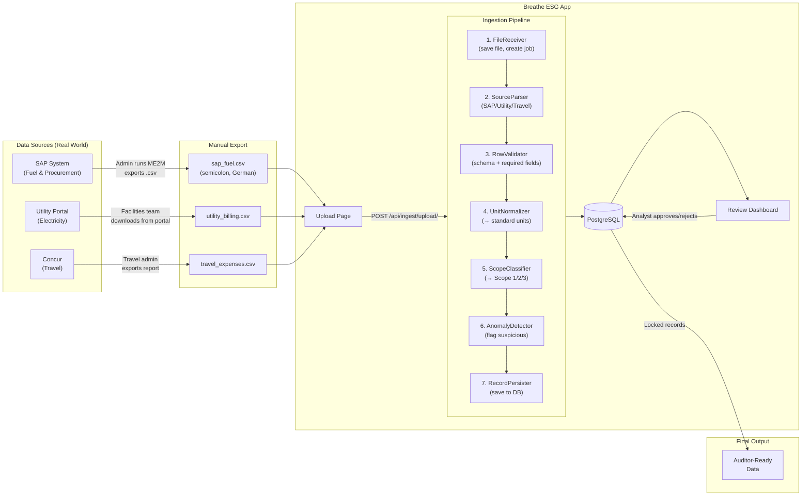

# Breathe ESG — Emissions Data Ingestion & Review Platform

A Django REST + React prototype that solves the real-world problem of enterprise emissions data being scattered across incompatible systems. It ingests raw data files from three sources — SAP (fuel & procurement), utility portals (electricity), and Concur-style corporate travel platforms — normalizes them into a common schema, flags anomalies automatically, and provides an analyst review dashboard where records can be approved, rejected, and locked for external auditors.

Built as a 4-day prototype. See [DECISIONS.md](DECISIONS.md) for every significant design choice and [TRADEOFFS.md](TRADEOFFS.md) for an honest list of what was deliberately left out.

## 🚀 Live Link

**Production URL**: [https://breathe-esg-vatsal.up.railway.app/](https://breathe-esg-vatsal.up.railway.app/)

## Architecture

- **Backend**: Django 5 + Django REST Framework + PostgreSQL
- **Frontend**: React 18 + Vite
- **Auth**: JWT (djangorestframework-simplejwt)
- **Deployment**: Railway

### End-to-End Data Flow




## Quick Start

### Backend
```bash
cd backend
python -m venv venv
source venv/bin/activate  # or venv\Scripts\activate on Windows
pip install -r requirements.txt
python manage.py migrate
python manage.py seed_demo
python manage.py runserver
```

### Frontend
```bash
cd frontend
npm install
npm run dev
```

## Data Sources

| Source | Format | Scope |
|--------|--------|-------|
| SAP (Fuel & Procurement) | Semicolon-delimited flat file, German headers | Scope 1 & 3 |
| Utility (Electricity) | Portal CSV export | Scope 2 |
| Corporate Travel | Concur-style CSV export | Scope 3 |

## Documentation

- [MODEL.md](MODEL.md) — Data model design and rationale
- [DECISIONS.md](DECISIONS.md) — Ambiguity resolution and design choices
- [TRADEOFFS.md](TRADEOFFS.md) — What I deliberately didn't build
- [SOURCES.md](SOURCES.md) — Research on real-world data source formats

## Sample Data

Three realistic sample files are in `sample_data/` — one per source type:

| File | What it simulates |
|------|------------------|
| `sap_fuel_procurement.csv` | SAP ME2M export — semicolons, German headers, Scope 1 fuel and Scope 3 procurement rows |
| `utility_electricity.csv` | Utility portal CSV — monthly meter readings, one estimated read flagged automatically |
| `travel_concur_export.csv` | Concur expense export — flights with IATA codes, Haversine distance, cabin class |

Upload via the UI after logging in, or run the test script to hit the API directly:

```bash
cd backend
python test_upload.py
```
